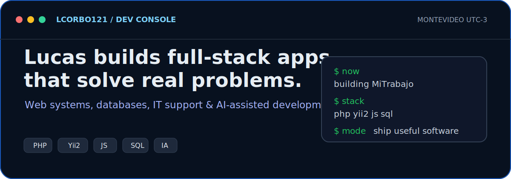
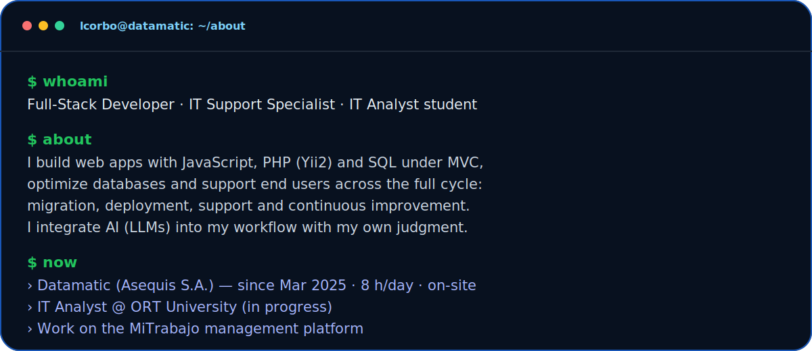

<!-- Presentación animada (estilo MasonSlover) -->

  

  

  
  
  

---

<h3 align="center">🚀 About me</h3>

  

---

<h3 align="center">🛠️ Stack tecnológico</h3>

  

  

  Yii2 · Odoo ERP · Insomnia · IA / LLMs (OpenAI · Claude)

---

### 📌 Proyectos destacados

| Proyecto | Descripción | Tecnologías |
|----------|-------------|-------------|
| 🤖 **Bot WhatsApp con IA** | Asistente conversacional integrado a WhatsApp con respuestas generadas por IA, base de conocimiento y aprendizaje continuo. | `Node.js` `LLMs` `MySQL` |
| 🧩 [**StellarMinds-API-SOLID**](https://github.com/lcorbo121/StellarMinds-API-SOLID) | API REST construida aplicando principios SOLID y arquitectura limpia. | `C#` `.NET` |
| 🌐 [**StellarMinds-MVC**](https://github.com/lcorbo121/StellarMinds-MVC) | Aplicación web bajo patrón MVC. | `C#` `.NET` `HTML` |

> 💡 Algunos de mis proyectos profesionales son privados. ¡Con gusto te muestro más en una entrevista!

---

### 📊 Métricas de GitHub

  

  

---

### 🎓 Formación

- **Analista en Tecnologías de la Información** — Universidad ORT Uruguay *(en curso)*
- **Bachillerato Tecnológico – Auxiliar Técnico en Informática** — Polo Tecnológico (UTU) *(finalizado)*
- **Formación en idioma Inglés** — English Connect

---

<i>Siempre abierto a nuevos retos y oportunidades 🚀</i>

