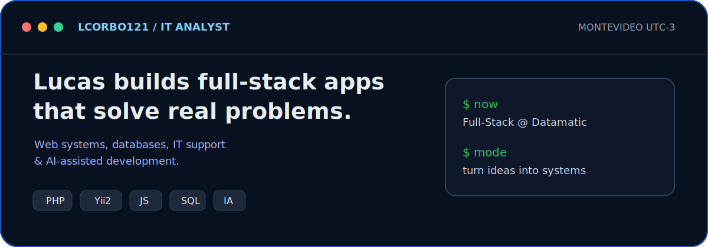

  

  
  
  

---

  

  

  Yii2 · Odoo ERP · Insomnia · IA / LLMs (OpenAI · Claude)

---

<h3 align="center">📌 Proyectos destacados</h3>

<table>
  <tr>
    <td width="50%" valign="top">
      <h4>🚌 <a href="https://github.com/lcorbo121/MiBondi">MiBondi</a> &nbsp;<a href="https://mibuscorbo.somee.com/">🔗 demo en vivo</a></h4>
      
App web que muestra sobre un mapa, en tiempo real, la posición de los ómnibus del Sistema de Transporte Metropolitano (STM) de Montevideo.

      
<code>C#</code> <code>ASP.NET Core</code> <code>MVC</code> <code>JavaScript</code>

    </td>
    <td width="50%" valign="top">
      <h4>🏢 MiTrabajo &nbsp;🔒 privado</h4>
      
Plataforma de gestión empresarial (ERP) en producción y multiempresa. Trabajo full-stack en módulos de RR.&nbsp;HH., encuestas, informes y reportería sobre una base de código grande y de uso real.

      
<code>PHP</code> <code>Yii2</code> <code>SQL</code> <code>JavaScript</code>

    </td>
  </tr>
  <tr>
    <td width="50%" valign="top">
      <h4>🤖 Bot WhatsApp con IA &nbsp;🔒 privado</h4>
      
Asistente conversacional integrado a WhatsApp con respuestas generadas por IA, base de conocimiento y aprendizaje continuo.

      
<code>Node.js</code> <code>LLMs</code> <code>MySQL</code>

    </td>
    <td width="50%" valign="top">
      <h4>🧩 <a href="https://github.com/lcorbo121/StellarMinds-API-SOLID">StellarMinds-API-SOLID</a></h4>
      
API REST construida aplicando principios SOLID y arquitectura limpia.

      
<code>C#</code> <code>.NET</code>

    </td>
  </tr>
  <tr>
    <td width="50%" valign="top">
      <h4>🌐 <a href="https://github.com/lcorbo121/StellarMinds-MVC">StellarMinds-MVC</a></h4>
      
Aplicación web bajo el patrón MVC.

      
<code>C#</code> <code>.NET</code> <code>HTML</code>

    </td>
    <td width="50%" valign="top"></td>
  </tr>
</table>

---

  <picture>
    <source media="(prefers-color-scheme: dark)" srcset="https://raw.githubusercontent.com/lcorbo121/lcorbo121/output/github-snake-dark.svg" />
    <source media="(prefers-color-scheme: light)" srcset="https://raw.githubusercontent.com/lcorbo121/lcorbo121/output/github-snake.svg" />
    
  </picture>

---

### 🎓 Formación

- **Analista en Tecnologías de la Información** — Universidad ORT Uruguay *(en curso)*
- **Bachillerato Tecnológico – Auxiliar Técnico en Informática** — Polo Tecnológico (UTU) *(finalizado)*
- **Formación en idioma Inglés** — English Connect

---

<i>Siempre abierto a nuevos retos y oportunidades 🚀</i>

